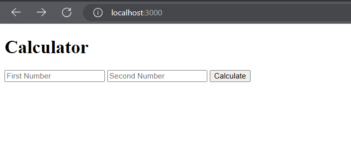

# BMI Calculator and Calculator App

This repository contains a simple web application that consists of two parts: a BMI Calculator and a basic calculator. The BMI Calculator allows you to calculate your Body Mass Index (BMI) based on your weight and height. The basic calculator performs addition of two numbers.

## BMI Calculator

### How to Use

1. Open the BMI Calculator web page by navigating to `/bmiCalculator` on your server.
2. Enter your weight in kilograms in the "Weight" input field.
3. Enter your height in meters in the "Height" input field.
4. Click the "Calculate BMI" button to see your BMI displayed on the screen.

### Formula

The BMI is calculated using the following formula:

BMI = weight / (height * height)

## Basic Calculator

### How to Use

1. Open the calculator web page by navigating to the root `/` of your server.
2. Enter the first number in the "First Number" input field.
3. Enter the second number in the "Second Number" input field.
4. Click the "Calculate" button to see the sum of the two numbers displayed on the screen.

### Example

If you enter `5` as the first number and `10` as the second number, the calculator will display:

The result of your numbers is: 15

## Screenshots

## Running the Application

To run the application, make sure you have [Node.js](https://nodejs.org/) installed on your machine. Then, follow these steps:

1. Clone the repository to your local machine.
2. Navigate to the project directory in your terminal.
3. Install the required dependencies by running `npm install`.
4. Start the server with the command `node calculator.js`.
5. Open your web browser and visit `http://localhost:3000` to use the basic calculator or `http://localhost:3000/bmiCalculator` for the BMI Calculator.

That's it! You can now use the BMI Calculator and basic calculator on your local machine.

## Contributing

If you want to contribute to this project, feel free to submit a pull request. Contributions are welcome!

## License

This project is licensed under the [MIT License](LICENSE).
